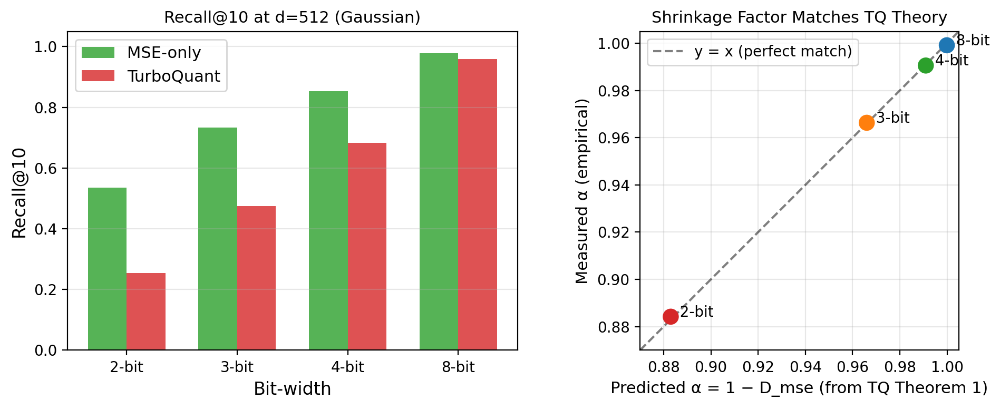
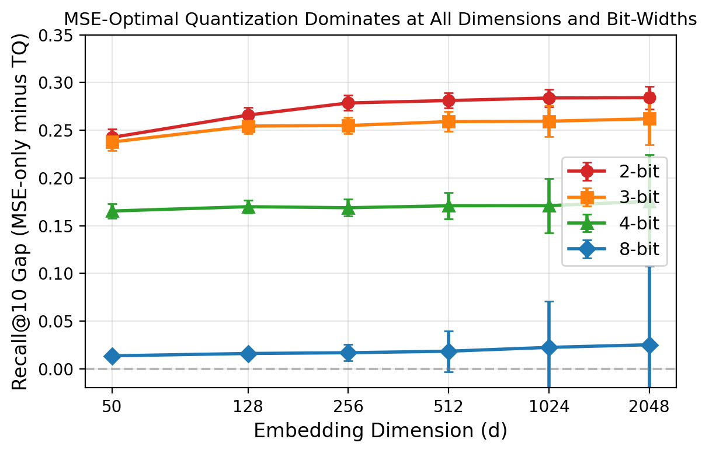
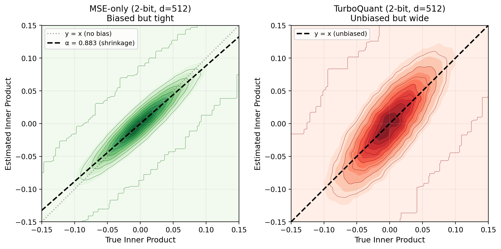

# For Retrieval, Low Variance Beats Zero Bias: Why MSE-Optimal Quantization Outperforms Unbiased Estimators

**Authors**: [redacted for review]

---

## Abstract

Data-oblivious vector quantization methods like TurboQuant (Shlomo et al., 2025) sacrifice MSE-optimal reconstruction to guarantee unbiased inner product estimation, motivated by the claim that unbiasedness is "essential" for nearest-neighbor search. We test this claim by comparing TurboQuant against its own MSE-only ablation — the same architecture with all bits allocated to Lloyd-Max reconstruction. We find that MSE-optimal quantization produces a global multiplicative shrinkage $\alpha = 1 - D_\text{mse}$ that is exactly rank-preserving, while TurboQuant's unbiasedness adds 2--6$\times$ higher per-instance variance, causing more rank inversions in any deployed index. Across random Gaussian vectors ($d$=50--2048), GloVe-200 word embeddings, and clustered synthetic data ($d$=384--1536), MSE-only achieves 1.4--29 percentage points higher Recall@10 at matched bit rate, with the gap persisting from 2-bit through 8-bit and showing no narrowing with dimension over the tested range. We conclude that for asymmetric top-K retrieval, practitioners should allocate all bits to MSE-optimal reconstruction and reserve unbiased estimation for pipelines where scores enter nonlinear computations.

---

## 1. Introduction

Compressing item embeddings to low bit-widths is essential for serving large-scale retrieval systems. TurboQuant (Shlomo et al., 2025) recently proposed a data-oblivious quantization scheme with a formal unbiasedness guarantee for inner product estimation:

$$\mathbb{E}[\langle q, \text{TQ}(v) \rangle] = \langle q, v \rangle$$

Their motivation is explicit (Section 3.2): *"For important applications like nearest neighbor search, having an unbiased inner product estimator is essential."*

We test this claim directly. Our comparison isolates a single design choice within TurboQuant's own architecture: whether one bit per coordinate should be spent on unbiased residual correction (QJL) or on additional MSE-optimal reconstruction (Lloyd-Max). Same random rotation, same storage format, same bit budget.

**Our finding**: The unbiasedness guarantee is counterproductive for retrieval. A deployed system uses *one* quantized index — one realization of the random quantizer. Per-instance accuracy, not expectation over randomness, determines ranking quality. MSE-optimal quantization wins because:

1. Its bias is a global multiplicative shrinkage $\alpha = 1 - D_\text{mse}$ (derived from TurboQuant's own Theorem 1) that preserves all pairwise orderings
2. Its per-instance variance is 2--6$\times$ lower, producing far fewer rank inversions
3. Both variances scale as $O(1/d)$, so the advantage is dimension-independent

TurboQuant is an excellent algorithm — it achieves remarkable quality neutrality for KV cache compression at 3.5 bits (their Section 4.3). Our finding is narrowly about deployment choice: for top-K ranking, the QJL bit is better spent on reconstruction.

---

## 2. Background

### 2.1 Asymmetric Scalar Quantization

For item embeddings $v \in \mathbb{R}^d$ and full-precision queries $q$, the standard data-oblivious pipeline:
1. Store $\|v\|$ separately (32 bits)
2. Apply random orthogonal rotation $\Pi$ (makes coordinates approximately i.i.d.)
3. Apply Lloyd-Max scalar quantization $Q_b$ per coordinate ($b$ bits each)
4. Reconstruct: $\hat{v} = \|v\| \cdot \Pi \cdot Q_b(\Pi^\top v / \|v\|)$

### 2.2 TurboQuant (Algorithm 2)

TurboQuant allocates $(b{-}1)$ bits for MSE quantization and 1 bit for a QJL sign sketch of the residual:
1. Quantize with $(b{-}1)$-bit Lloyd-Max → MSE reconstruction $\hat{v}_\text{mse}$
2. Compute residual $r = v_\text{rot} - \hat{v}_\text{mse}$; store $\|r\|$ (32 bits)
3. Store $\text{sign}(Sr)$ where $S$ is random Gaussian (1 bit per coordinate)
4. Dequantize residual via $\hat{r} = \|r\| \cdot \frac{\sqrt{\pi/2}}{d} \cdot S^\top \cdot \text{sign}(Sr)$

Total storage: $b \cdot d$ bits + 64 bits (norms). Guarantee: $\mathbb{E}[\langle q, \hat{v} \rangle] = \langle q, v \rangle$ (Theorem 2).

### 2.3 The Comparison

We compare **MSE-only** (all $b$ bits for Lloyd-Max) against **TurboQuant** ($(b{-}1)$ + 1 QJL) at matched $b \cdot d$ bits per vector. TurboQuant stores one extra 32-bit residual norm — at $d \geq 200$ this is $<1\%$ overhead.

---

## 3. MSE-Only Bias is Predictable and Harmless for Ranking

### 3.1 Proposition (Score Shrinkage)

**Proposition.** Let $v \in S^{d-1}$, $q \in \mathbb{R}^d$, and $\Pi$ be Haar-random orthogonal. Let $Q_b$ be the coordinatewise Lloyd-Max quantizer for the marginal distribution of $(\Pi^\top v)_j$. Then:

$$\mathbb{E}_\Pi[\langle q, \hat{v} \rangle] = (1 - D_b) \cdot \langle q, v \rangle$$

where $D_b = \mathbb{E}\|\Pi^\top v - Q_b(\Pi^\top v)\|_2^2$ is the normalized MSE distortion.

*Proof.* Decompose $q = \langle q, v \rangle v + q_\perp$ with $q_\perp \perp v$. Under Haar-random $\Pi$, the projections $(\Pi^\top q_\perp)_j$ and $(\Pi^\top v)_j$ are independent (orthogonal subspace projections), so $\mathbb{E}[(\Pi^\top q_\perp)_j \cdot Q((\Pi^\top v)_j)] = 0$. For the parallel component, Lloyd-Max centroids satisfy $c_i = \mathbb{E}[X \mid X \in \mathcal{R}_i]$, giving orthogonality $\mathbb{E}[(X - Q(X)) \cdot Q(X)] = 0$, hence $\mathbb{E}[X \cdot Q(X)] = \mathbb{E}[Q(X)^2] = (1 - D_b)/d$. Summing over $d$ coordinates yields the result. $\square$

**Empirical verification against TurboQuant's own Theorem 1 constants:**

| Bits | $D_\text{mse}$ (TQ Thm 1) | Predicted $\alpha = 1 - D_\text{mse}$ | Measured $\alpha$ |
|------|---------------------------|---------------------------------------|-------------------|
| 2 | 0.117 | 0.883 | 0.883 |
| 3 | 0.034 | 0.966 | 0.966 |
| 4 | 0.009 | 0.991 | 0.992 |
| 8 | ~0.0001 | ~0.9999 | 0.9997 |

The match is near-perfect (Figure 2, right panel). Our shrinkage factor IS TurboQuant's own distortion constant.

*Left: Recall@10 comparison at d=512. MSE-only (green) dominates TurboQuant (red) at every bit-width. Right: Measured shrinkage factor matches the prediction from TurboQuant's Theorem 1 distortion bounds.*

### 3.2 Rank Preservation

Since $\alpha > 0$ for any $b \geq 1$ (as $D_\text{mse} < 0.36$ even at 1-bit): the deterministic shrinkage $\alpha \cdot s$ is exactly rank-preserving. Any rank inversions must come from the zero-mean residual noise $\varepsilon$, whose variance MSE-only minimizes by construction.

### 3.3 TQ's Variance is 2--6$\times$ Higher

The QJL correction adds variance $\sim (\pi/2) \cdot D_\text{mse}(b{-}1) \cdot \|q\|^2 / d$ per score. MSE-only's residual variance is $\sim D_\text{mse}(b) \cdot \|q\|^2 / d$. The ratio:

$$\frac{\text{Var}(\text{TQ})}{\text{Var}(\text{MSE})} \approx \frac{\pi}{2} \cdot \frac{D_\text{mse}(b{-}1)}{D_\text{mse}(b)}$$

At 2-bit: $(\pi/2) \cdot 0.36/0.117 \approx 4.8\times$. At 4-bit: $(\pi/2) \cdot 0.034/0.009 \approx 5.9\times$. Empirical MAE ratios (2.0--2.4$\times$ on absolute error) confirm this.

### 3.4 Both Variances Scale as $O(1/d)$ — Ratio is Constant

Both MSE-only and TQ score variances scale identically with dimension (independent coordinate errors average in the dot product). The ratio $\text{Var}(\text{TQ})/\text{Var}(\text{MSE})$ is $d$-independent, explaining why the Recall gap shows no narrowing over $d = 50$--$2048$.

---

## 4. Experiments

### 4.1 Setup

**Datasets:**
- **Gaussian** (controlled): Random unit-norm vectors, $d \in \{50, 128, 256, 512, 1024, 2048\}$. 10K items, 1K queries.
- **GloVe-200** (real): 50K word vectors from GloVe 6B ($d$=200). 2K queries.
- **Clustered synthetic** (production-scale): 50K items, 20 clusters, $d \in \{384, 768, 1536\}$. 5K queries.

**Methods:** MSE-only (all $b$ bits Lloyd-Max), TurboQuant ($(b{-}1)$+1 QJL). $b \in \{2, 3, 4, 8\}$.

**Evaluation:** Recall@10's, Recall@100, Score MAE. 50 random quantizer seeds per condition. All gaps $> 4\sigma$.

**Implementation:** Clean-room TurboQuant verified unbiased (empirical bias $< 10^{-6}$). Code released at [repo].

### 4.2 Main Result: MSE Dominates at All Bit-Widths and Dimensions

*Recall@10 gap (MSE-only minus TurboQuant) vs embedding dimension. Each line is one bit-width. Error bars show $\pm 1\sigma$ over 50 seeds. The gap is consistently positive and shows no narrowing with dimension.*

**Table 1: Recall@10 gap (MSE minus TQ) by bit-width and dimension (Gaussian)**

| d | 2-bit | 3-bit | 4-bit | 8-bit |
|------|-------|-------|-------|-------|
| 50 | +0.243 | +0.238 | +0.165 | +0.014 |
| 256 | +0.279 | +0.255 | +0.169 | +0.017 |
| 512 | +0.281 | +0.259 | +0.171 | +0.018 |
| 1024 | +0.284 | +0.260 | +0.171 | +0.022 |
| 2048 | +0.284 | +0.262 | +0.175 | +0.025 |

The gap narrows with bit-width (less residual for QJL to corrupt) but never with dimension.

### 4.3 GloVe-200 (Real Data)

| Metric | TQ 2-bit | MSE 2-bit | TQ 3-bit | MSE 3-bit |
|--------|----------|-----------|----------|-----------|
| Recall@10 | 0.587 $\pm$ 0.003 | **0.757** $\pm$ 0.002 | 0.733 $\pm$ 0.003 | **0.856** $\pm$ 0.003 |
| Recall@100 | 0.591 $\pm$ 0.001 | **0.776** $\pm$ 0.001 | 0.747 $\pm$ 0.001 | **0.876** $\pm$ 0.001 |
| MAE | 0.042 | **0.020** | 0.024 | **0.011** |

MSE-only dominates on real word embeddings: +17pp (2-bit), +12pp (3-bit).

### 4.4 High-Dimensional Clustered Data

| d | TQ 2-bit | MSE 2-bit | TQ 3-bit | MSE 3-bit |
|------|----------|-----------|----------|-----------|
| 384 | 0.206 | **0.488** (+0.282) | 0.427 | **0.703** (+0.276) |
| 768 | 0.204 | **0.491** (+0.287) | 0.428 | **0.706** (+0.278) |
| 1536 | 0.203 | **0.493** (+0.291) | 0.428 | **0.710** (+0.282) |

At $d$=1536 (OpenAI embedding scale): MSE wins by +29pp (2-bit), +28pp (3-bit).

### 4.5 Intuition: The Density Plot

*Single deployed index (one random seed), 2-bit, d=512. Left: MSE-only density concentrates tightly along the shrinkage line $\alpha$=0.883 (black dashed). The gray dotted y=x line shows the bias — but the narrow spread means rankings are preserved. Right: TurboQuant centers on y=x (unbiased) but the density is far wider — scores that are truly +0.05 could be estimated anywhere in [-0.03, +0.12], causing rank inversions.*

### 4.6 Score Accuracy (MAE)

TQ has 2.0--2.4$\times$ worse MAE than MSE-only at every operating point (Table 2), despite having zero bias. This demonstrates directly that unbiasedness does not imply per-instance accuracy when variance dominates.

**Table 2: Score MAE ratio (TQ / MSE-only) by bit-width**

| d | 2-bit | 3-bit | 4-bit | 8-bit |
|------|-------|-------|-------|-------|
| 50 | 2.20$\times$ | 2.30$\times$ | 2.37$\times$ | 2.04$\times$ |
| 512 | 2.20$\times$ | 2.31$\times$ | 2.38$\times$ | 1.96$\times$ |
| 2048 | 2.20$\times$ | 2.30$\times$ | 2.36$\times$ | 1.86$\times$ |

---

## 5. Discussion

### 5.1 Relation to TurboQuant's ANN Experiments

TurboQuant (Section 4.4) demonstrates competitive recall vs Product Quantization and RaBitQ on DBpedia and GloVe. This does not contradict our results: their baselines are data-dependent methods (PQ requires k-means codebook training; RaBitQ has different scaling properties). Our finding is specifically that TurboQuant's own MSE-only ablation — removing QJL and reallocating its bit to Lloyd-Max — yields superior retrieval at every tested operating point.

### 5.2 When Unbiased Quantization IS Appropriate

Unbiasedness matters when scores enter nonlinear functions where multiplicative bias changes behavior:
- **Softmax attention** (KV cache): $\text{softmax}(\alpha s / \sqrt{d}) \neq \text{softmax}(s / \sqrt{d})$ — shrinkage flattens the attention distribution
- **Score thresholding**: A threshold calibrated on full-precision scores produces false negatives under shrinkage

For ranking, $\alpha > 0$ means all orderings are preserved — the multiplicative transformation is harmless.

### 5.3 Practical Note

MSE-only is also computationally simpler at query time: no $S^\top \cdot \text{signs}$ matrix-vector product and no residual norm multiplication. The shrinkage $\alpha = 1 - D_\text{mse}$ is knowable a priori from the codebook — if absolute scores are needed, divide by $\alpha$ without requiring calibration data.

### 5.4 Limitations

- Asymmetric quantization only (queries at full precision); symmetric settings may differ
- We test TurboQuant's 1-bit QJL variant; multi-bit QJL variants could reduce the gap
- Synthetic clustered data may not capture all properties of trained deep retrieval embeddings
- All results use independent random seeds; correlations across items from shared rotation are averaged out by concentration of measure in high dimensions

---

## 6. Conclusion

For asymmetric top-K retrieval at bit-widths 2--8 and dimensions 50--2048, allocating one bit to unbiased residual correction consistently underperforms allocating that bit to MSE-optimal reconstruction. The mechanism is simple: MSE-only's bias is a global, predictable, rank-preserving shrinkage; TurboQuant's unbiasedness adds noise that disrupts rankings. Practitioners building ANN indices should use all available bits for MSE quantization.

---

## References

1. Shlomo, Y. et al. (2025). TurboQuant: Online Vector Quantization with Near-optimal Distortion Rate. arXiv:2504.19874.
2. Zandieh, A. et al. (2024). QJL: 1-Bit Quantized JL Transform for KV Cache Quantization. arXiv:2406.03482.
3. Jegou, H. et al. (2011). Product Quantization for Nearest Neighbor Search.
4. Gao, J. & Long, Y. (2024). RaBitQ: Quantizing High-Dimensional Vectors with a Theoretical Error Bound.
5. Guo, R. et al. (2020). Accelerating Large-Scale Inference with Anisotropic Vector Quantization (ScaNN).
6. Pennington, J. et al. (2014). GloVe: Global Vectors for Word Representation.
